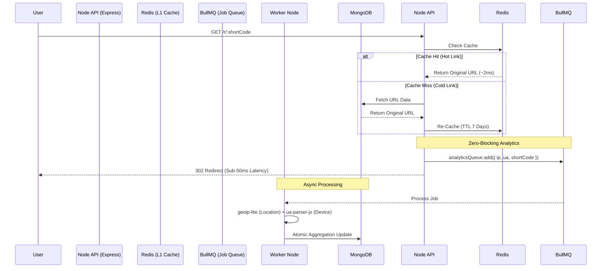

<div align="center">

  <h1>⚡ PULSE.IO</h1>
  
  <h3>SCALE AT LIGHTSPEED.</h3>

  <p>
    <strong>A High-Performance URL Intelligence Platform with Zero-Blocking Analytics.</strong>
  </p>

  <a href="https://pulse-io-psi.vercel.app">
    
  </a>

  <br />
  <br />

  
  
  
  
  
  

</div>

<br />

---

## 🚀 Mission Brief

**Pulse.io** isn't just a URL shortener—it is an enterprise-grade **link routing and marketing analytics engine**. Designed to handle massive concurrent traffic spikes, the platform decouples heavy analytics processing from the critical redirect path, guaranteeing ultra-low latency routing for end-users while providing creators with deep, "God-Mode" traffic insights.

Wrapped in a stunning, responsive **Cyberpunk/Glassmorphism UI**, it merges extreme backend scalability with premium frontend aesthetics.

---

## 🏗️ System Architecture

Pulse.io uses a highly distributed, zero-blocking architecture. When a user clicks a shortened link, the system resolves the routing from an `O(1)` **Redis Cache** in milliseconds. Simultaneously, a fire-and-forget job is pushed to **BullMQ**, where background workers handle the heavy lifting of parsing User-Agents and Geo-IP data without blocking the user's redirect.



---

## 📈 Performance & Scalability Metrics

We didn't just build a dashboard; we engineered a platform that can scale.

* ⚡ **Sub-50ms Redirect Latency:** By implementing a strict **Redis caching layer** (7-day TTL), hot links never touch the database. 
* 🔄 **Zero-Blocking Ingestion:** Using **BullMQ**, clickstream telemetry (IP, OS, Browser, Timestamps) is offloaded entirely to background worker threads.
* 🌍 **Zero-Network Telemetry:** Instead of relying on slow, rate-limited third-party APIs for location lookups, we utilize localized RAM databases (`geoip-lite`) to parse geographies in `< 1ms`.
* 🛡️ **Cryptographic Abuse Prevention:** Rate limiting blocks DDoS attempts (100 req/15min), while password-gated links utilize `bcrypt` (cost factor 10) to intentionally prevent brute-force attacks.

---

## ✨ Key Features & UI

### 1.  Marketing Dashboard
A visually stunning, glassmorphism-inspired Bento grid layout that visualizes complex MongoDB aggregation pipelines in real-time.
* **Geospatial Heatmaps** & **Timeline Area Charts** powered by `Recharts`.
* **Frictionless Guest Mode:** Users can shorten links and view live analytics instantly without an account, acting as a high-conversion acquisition funnel before enforcing Google OAuth.

> *Insert Dashboard GIF here:* <br/>
> 

### 2. Classified (Password-Protected) Routing
Lock sensitive links behind an encrypted access gate. The redirect is paused, and users are greeted with a stunning UI requesting the access key.

> *Insert Password Gate GIF here:* <br/>
> 

### 3. Time-to-Live (TTL) & Custom Aliases
Create branded links (`pulse.io/my-brand`) and set strict expiration dates. Expired links automatically 410 (Gone), keeping your brand secure after a campaign ends.

---

## 🚀 Future Scalability Roadmap

As Pulse.io grows to handle 10M+ links, the architecture is designed to evolve:
1. **Kubernetes (K8s) Horizontal Pod Autoscaling (HPA):** Separate the `API nodes` (handling redirects) from the `Worker nodes` (handling BullMQ). If traffic spikes, we automatically spin up more API nodes without touching the workers.
2. **Kafka over BullMQ:** Transitioning the analytics ingestion queue from Redis-backed BullMQ to Apache Kafka for extreme high-throughput, persistent event streaming.
3. **ClickHouse for Analytics:** Migrating the `visitHistory` arrays out of MongoDB and into ClickHouse (a column-oriented database) for sub-second OLAP aggregations across billions of rows.

---

## 🛠️ Tech Stack

| Domain | Technologies |
| :--- | :--- |
| **Frontend** | React, Vite, Tailwind CSS, Framer Motion, Recharts |
| **Backend** | Node.js, Express.js |
| **Database & Cache** | MongoDB (Mongoose), Redis (`ioredis`) |
| **Message Queue** | BullMQ (Asynchronous Background Workers) |
| **Security** | Google OAuth, JWT, Bcrypt, Helmet, `express-rate-limit` |
| **Telemetry** | `ua-parser-js` (Device Detection), `geoip-lite` (Location) |

---

## ⚡ Setup Guide

Ignite your local command center in minutes.

### 1. Clone the Repository
```bash
git clone https://github.com/your-username/pulse-io.git
cd pulse-io
```

### 2. Install Dependencies
```bash
# Install Server Dependencies
cd server
npm install

# Install Client Dependencies
cd ../client
npm install
```

### 3. Environment Variables
Create a `.env` file in the `server` folder:
```env
PORT=5000
MONGO_URI=your_mongodb_connection_string
REDIS_URL=your_redis_connection_string
JWT_SECRET=your_super_secret_jwt_key
CLIENT_URL=http://localhost:5173
```

Create a `.env` file in the `client` folder:
```env
VITE_GOOGLE_CLIENT_ID=your_google_client_id
```

### 4. Ignite Engines 🚀
Ensure you have Redis running locally (or via Docker), then run the following in two separate terminals:

```bash
# Terminal 1: Starts Node API & BullMQ Workers
cd server && npm run dev

# Terminal 2: Starts React Client
cd client && npm run dev
```

<br/>
<div align="center">

Built with 💻 & ☕ by **Kartik Bhargava**

<sub>© 2026 Pulse.io Engineering. All Systems Operational.</sub>

</div>
